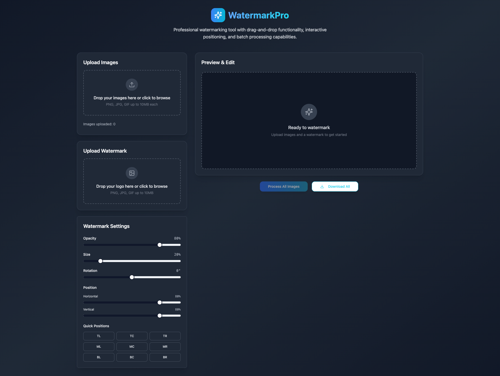

# Image Mark Studio

Batch watermark photos straight from the browser using the WatermarkPro interface built with Vite, React, shadcn/ui, and Tailwind CSS. Drag in assets, fine-tune the watermark overlay, and export ready-to-share images without leaving the app.

## Features
- Multi-image uploads with thumbnail tray and quick removal controls.
- Custom watermark logo upload, opacity/scale/rotation tweaks, and drag-to-position canvas.
- Batch “Process All” workflow plus one-click download of every processed file.
- Toast feedback for uploads, processing, and error states thanks to Sonner.
- Responsive gradient UI themed with Tailwind and shadcn/ui primitives.

## Tech Stack
React 18, TypeScript, Vite, Tailwind CSS, shadcn/ui + Radix, React Query, React Hook Form, Lucide icons.

## Screenshot


## Getting Started
Prerequisites: Node 18+ and npm.

```bash
npm install        # install dependencies
npm run dev        # start Vite dev server on http://localhost:5173
npm run build      # create production bundle in dist/
npm run preview    # serve the build locally
npm run lint       # run ESLint with React Hooks + Refresh rules
```

## Usage
1. Launch the dev server and open the URL.
2. Drop or browse photos into the **Upload Images** panel; thumbnails appear immediately.
3. Drop a PNG/SVG logo into **Upload Watermark**, then refine opacity, scale, rotation, and anchor using Watermark Controls or direct canvas dragging.
4. Toggle between original and watermarked previews, process every image, and download the generated files (`watermarked_<original>.png`).
5. Use the gallery tabs to remove unwanted uploads or reset the watermark asset.

## Project Structure
```
src/
  components/        # FileDropzone, WatermarkCanvas, shadcn/ui wrappers
  pages/             # Index landing page + router views
  hooks/             # Shared React hooks
  lib/               # Utility helpers and query logic
public/              # Static assets and fallback HTML
screenshots/         # Reference UI captures for docs/PRs
```

## Contributing
See `AGENTS.md` for contributor expectations (coding standards, testing notes, and PR checklist). Always document manual verification steps in pull requests, attach updated screenshots when UI changes, and ensure `npm run lint` + `npm run build` pass before requesting review.
